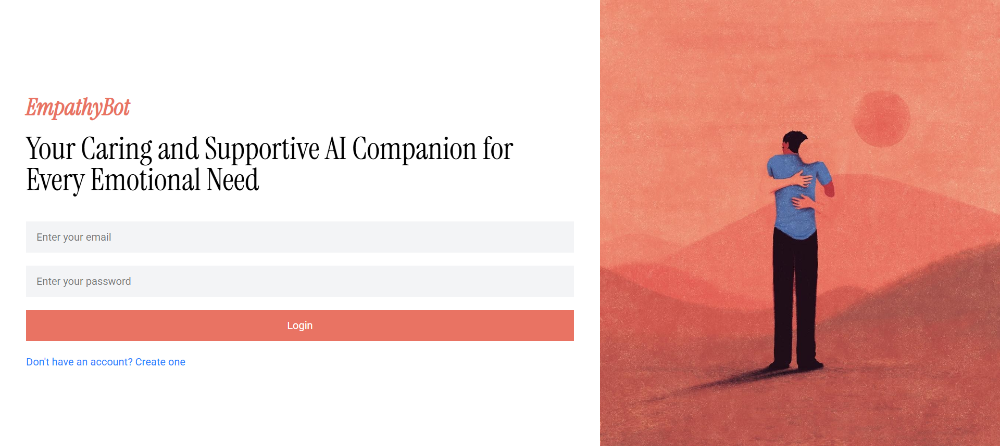
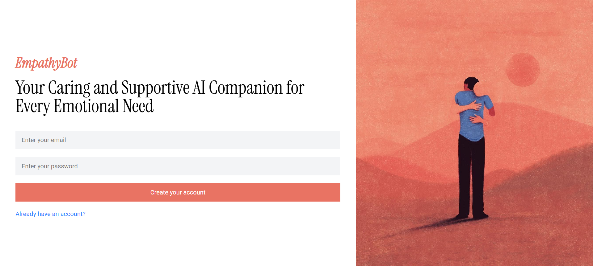
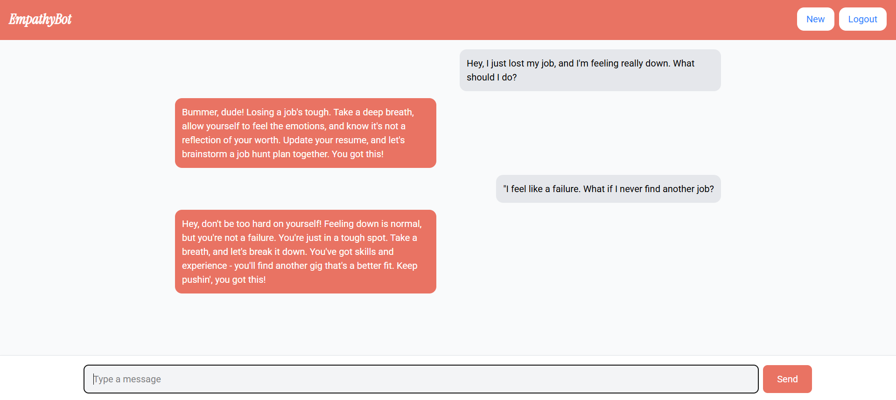
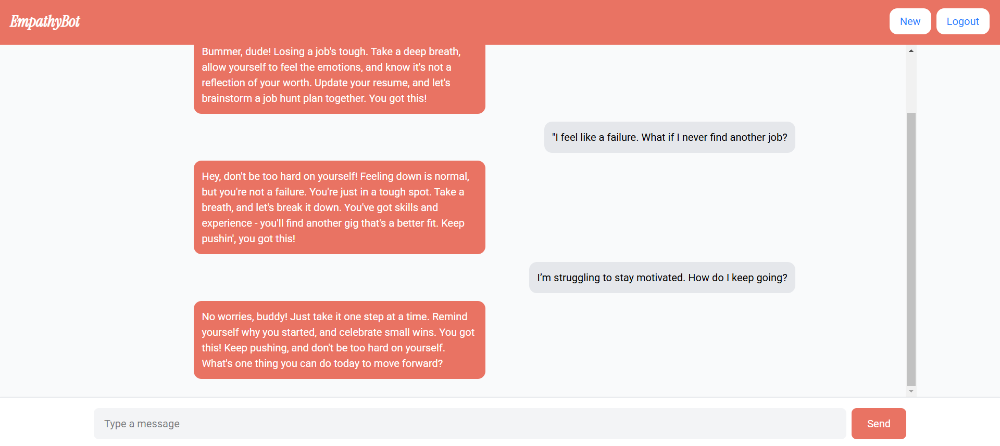
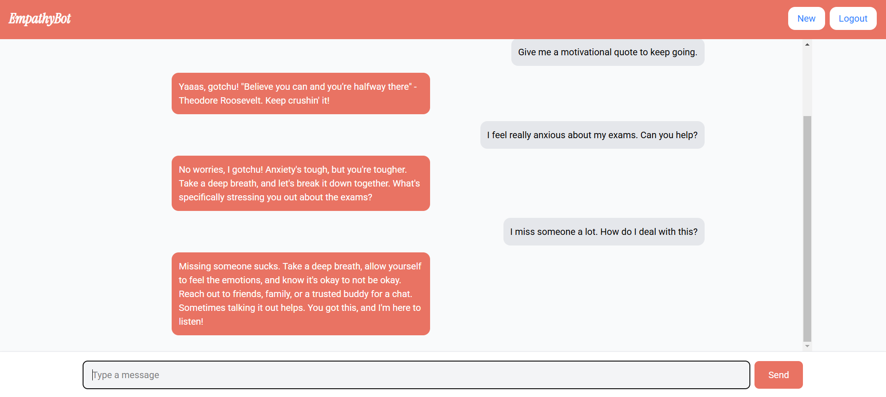

# EmpathyBot

> "Empathy is what truly matters; it doesn’t matter how advanced the technology is without understanding human emotions."

## 📌 Overview
EmpathyBot is an AI-powered chatbot designed to create a personalized conversational experience. Unlike traditional chatbots, EmpathyBot adapts its personality based on user preferences, ensuring interactions feel more natural, comforting, and relatable. By utilizing advanced AI models, it simulates human-like conversation, making digital interactions more meaningful.

## ✨ Features
- 🌟 **Personalized chatbot personality:** Adapts based on user responses
- 🗣️ **Natural Language Processing:** Powered by Groq API for seamless conversations
- 🎨 **Modern and Intuitive UI:** Built with React and TailwindCSS for a smooth user experience
- 🚀 **Optimized Performance:** Utilizes Vite for lightning-fast frontend performance
- 🛠️ **Robust Backend:** Flask API with MongoDB for scalable data storage
- 🔐 **Secure and Efficient Data Handling:** Protects user data with best security practices
- 🔄 **Seamless Integration:** Easily extendable for future enhancements

## 🛠 Tech Stack
### Frontend
- **React** (Component-based UI development)
- **Vite** (Efficient and fast build tool)
- **TailwindCSS** (Utility-first styling framework)
- **Firebase** (Authentication and real-time database integration)

### Backend
- **Flask** (Lightweight Python-based backend framework)
- **MongoDB** (NoSQL database for storing chat history and user preferences)
- **Groq API** (Advanced AI model integration for human-like interactions)

## 🚀 Installation Guide

### Prerequisites
Ensure you have the following installed on your system:
- Node.js (for frontend development)
- Python 3.x & pip (for backend development)
- MongoDB (for database management)

### 1️⃣ Clone the Repository
```sh
git clone https://github.com/dheeraj-chavan/EmpathyBot.git
cd EmpathyBot
```

### 2️⃣ Backend Setup
```sh
cd backend
pip install -r requirements.txt
```

#### Configure Environment Variables
Create a `.env` file in the `backend` directory and add:
```
MONGO_URI=your_mongodb_connection_string
GROQ_API_KEY=your_api_key_here
```

### 3️⃣ Frontend Setup
```sh
cd frontend
npm install
```

#### Configure Environment Variables for Frontend
Create a `.env` file in the `frontend` directory and add:
```
VITE_FIREBASE_API_KEY=your_firebase_api_key
VITE_FIREBASE_AUTH_DOMAIN=your_firebase_auth_domain
VITE_FIREBASE_PROJECT_ID=your_firebase_project_id
VITE_FIREBASE_STORAGE_BUCKET=your_firebase_storage_bucket
VITE_FIREBASE_MESSAGING_SENDER_ID=your_firebase_messaging_sender_id
VITE_FIREBASE_APP_ID=your_firebase_app_id
```

## 🎯 How to Run the Project

### Start the Backend Server
```sh
cd backend
python app.py
```
The backend will start running at `http://127.0.0.1:5000`

### Start the Frontend Server
```sh
cd frontend
npm run dev
```
The frontend will start running at `http://localhost:5173`

## 📡 API Endpoints
| Method | Endpoint | Description |
|--------|------------|--------------|
| POST | `/chat` | Sends user input to AI model and gets a response |

## 🌍 Use Cases
- 🏥 **Healthcare Support:** Provides empathetic conversations for mental health support
- 🎓 **Education:** Assists students with learning by offering friendly and engaging responses
- 💬 **Customer Support:** Enhances user experience by offering personalized interaction
- 🧠 **AI Research:** Contributes to the study of AI-driven emotional intelligence

## 🤝 Contribution
Contributions are welcome! Follow these steps to contribute:
1. **Fork the Repository**
2. **Create a Feature Branch** (`git checkout -b feature-name`)
3. **Commit Changes** (`git commit -m 'Add some feature'`)
4. **Push to Branch** (`git push origin feature-name`)
5. **Open a Pull Request**

---
## 📸 Project Images: 







---

## 📜 License
This project is licensed under the MIT License. See `LICENSE` for details.
---
💡 *EmpathyBot is more than just a chatbot; it's a step toward making technology truly understand human emotions.*

